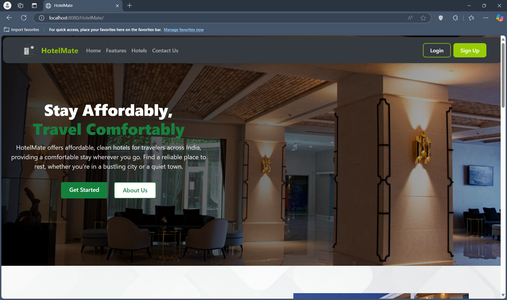
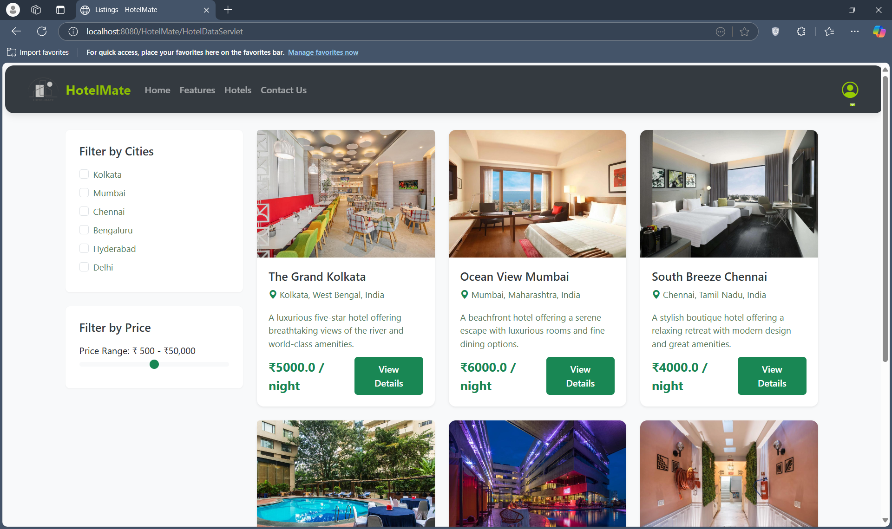
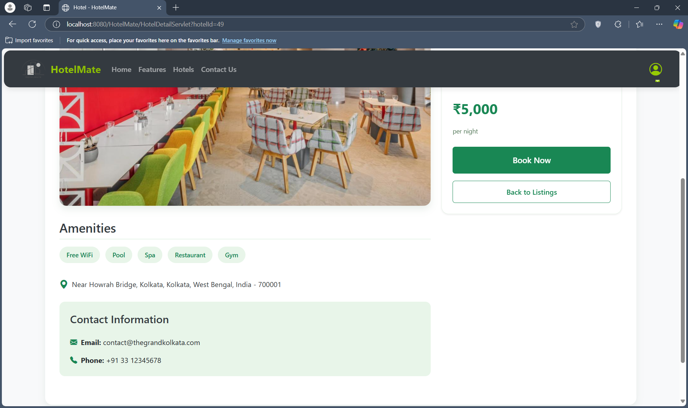
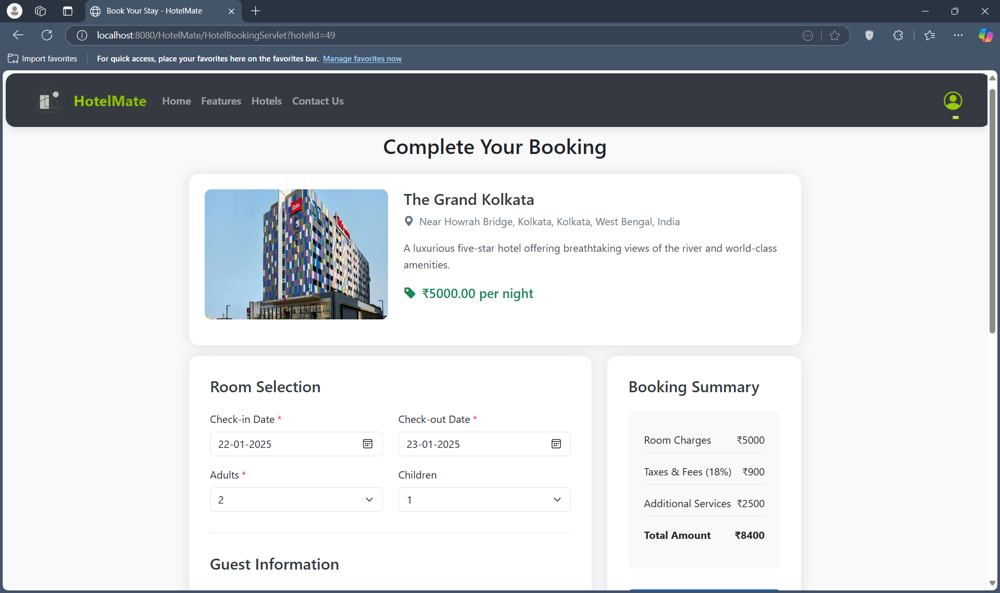
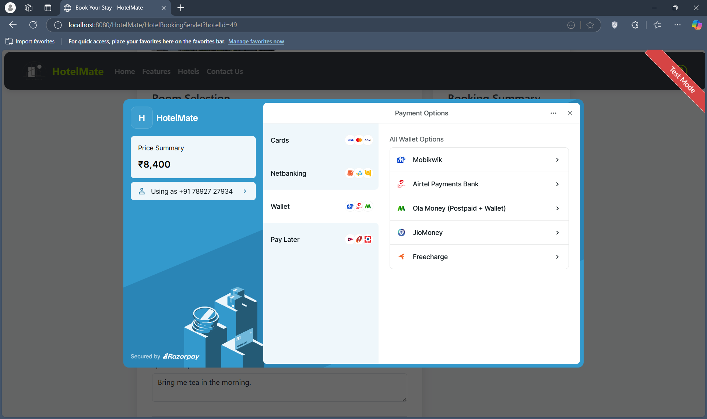
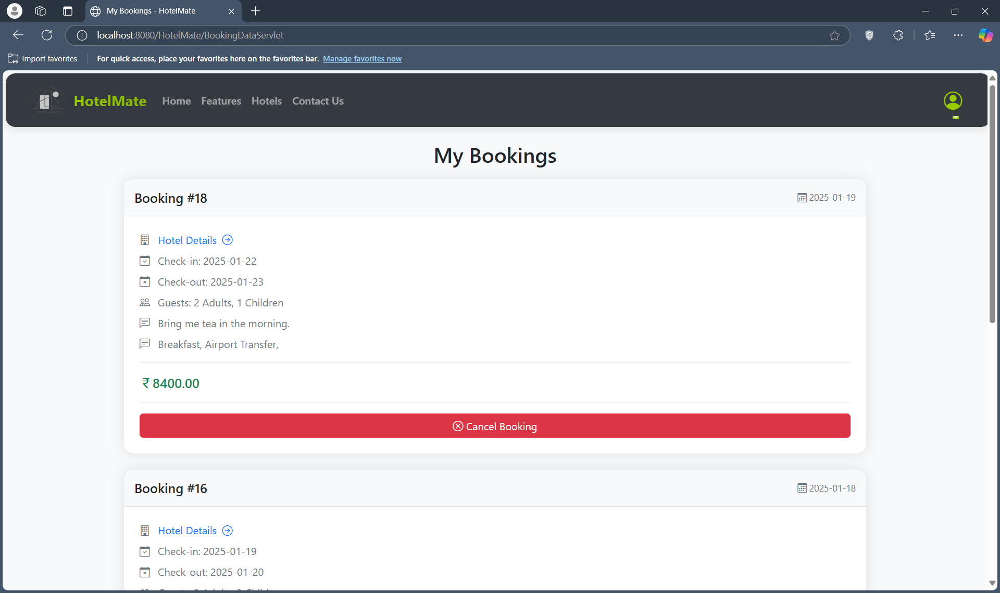
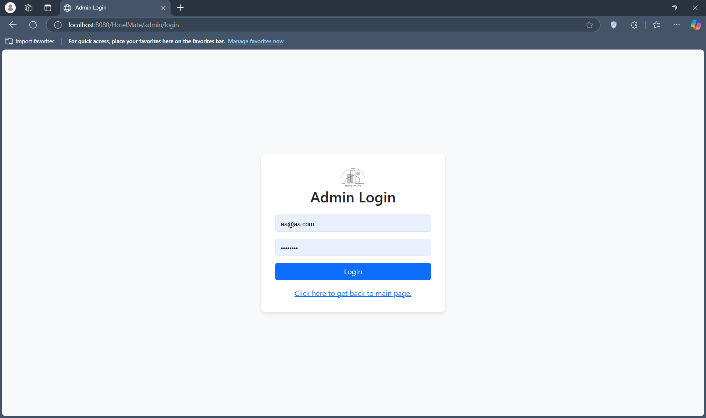
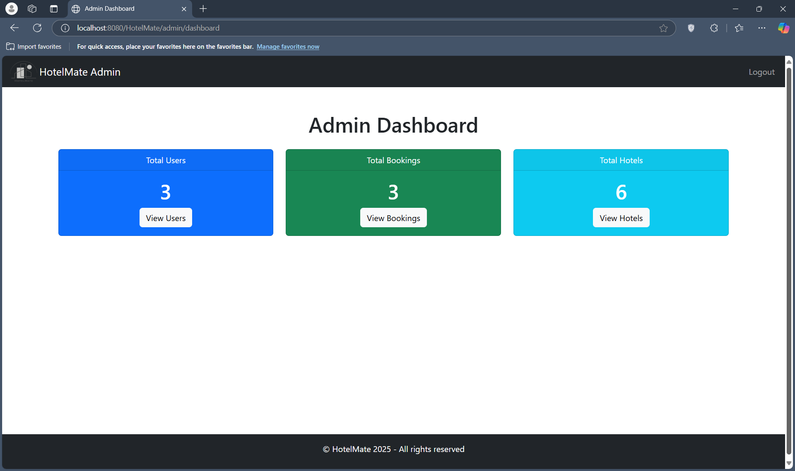
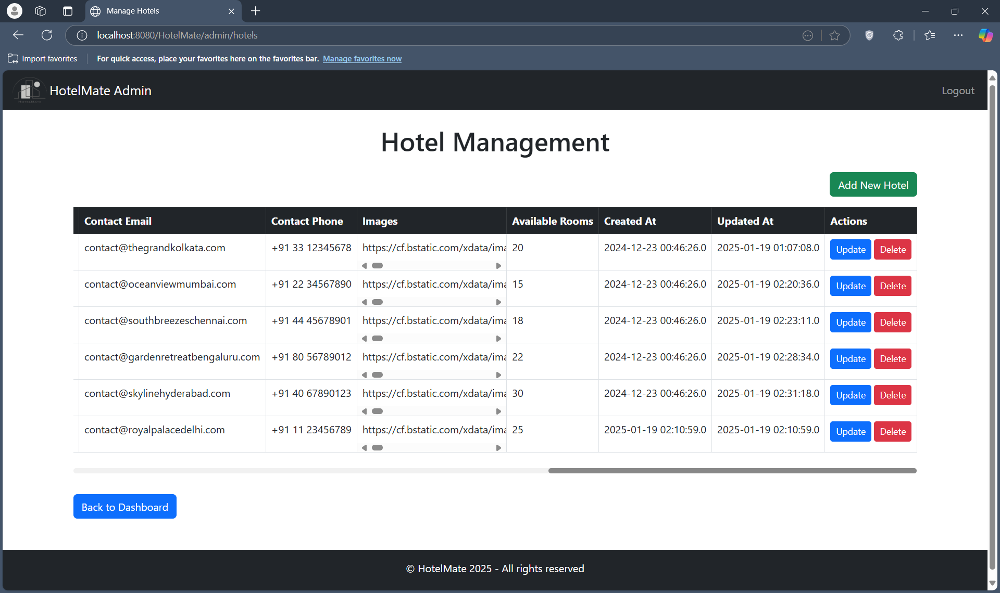

# HotelMate: Hotel Booking Web Application

HotelMate is a Java-based Dynamic Web Project designed to optimize the process of locating and reserving accommodations for urban travelers. It interfaces with an extensive database of curated hotel listings, enabling users to perform complex searches, apply multi-dimensional filters, and execute secure bookings. The application employs Java Servlets, JSP, and JDBC for backend development, managing business logic and database transactions, while JSP and HTML constitute the dynamic frontend. Apache Tomcat serves as the deployment environment, offering a reliable and scalable execution platform.

## Features

- Multi-criteria filtering based on location, price range, and amenities
- Secure booking process utilizing HTTPS and user authentication via session management
- Responsive design implemented using CSS media queries for cross-device compatibility
- Comprehensive admin panel for CRUD operations on hotel listings, bookings, and user accounts

## Technologies Used

- **Backend**: Java 17, Java Servlets 4.0, JSP 2.3, JDBC 4.2
- **Frontend**: JSP 2.3, HTML5, CSS3
- **Database**: MySQL 8.0 with InnoDB storage engine
- **Server**: Apache Tomcat 10.0
- **Version Control**: Git

## Dependencies

The application uses the following libraries, which are included in the `WEB-INF/lib` directory:

- Apache Commons Lang 3.17.0
- Apache Commons Text 1.13.0
- JSON 20140107
- JSTL 1.2
- Kotlin Standard Library 1.4.10
- OkHttp 4.9.1
- Okio 2.8.0
- MySQL Connector/J 9.1.0
- Razorpay Java SDK 1.4.8

## Configuration

The application is configured using the `web.xml` file located in the `WEB-INF` directory. This file defines the servlets, filters, and listeners used in the application.

## Screenshots

Here are some screenshots showcasing the main features of HotelMate:

### User Interface

#### Home Page:

#### Hotel Listing:

#### Hotel Details:

#### Booking Process:

#### Payment:

#### Booking Confirmation:

### Admin Interface

## Installation

1. Clone the repository:

   `git clone https://github.com/your-username/hotelmate.git`

2. Set up the database:
- Create a MySQL 8.0 database named `hotelmate`
- Import the provided `DatabaseSetup/databaseSetup.sql` file to initialize the schema and populate with sample data

3. Build and deploy to Apache Tomcat:
- Note: This project does not use Maven. Instead, all dependencies are manually included in the `WEB-INF/lib` directory. The IDE used was Eclipse that takes care of the following steps if the project is initializes as a Dynamic Web Project.
- Compile the Java source files in the `src/main/java` directory
- Package the compiled classes and web resources into a WAR file
- Deploy the generated WAR file to your Apache Tomcat 9.0 server

5. Access the application:
- Open a web browser and navigate to `http://localhost:8080/hotelmate`

## Contributing

Contributions are welcome! Please follow these steps:

1. Fork the repository
2. Create a new branch for your feature or bug fix
3. Commit your changes with descriptive commit messages
4. Push to your fork and submit a pull request with a detailed description of your changes

## Acknowledgments

- [Apache Tomcat](https://tomcat.apache.org/)
- [MySQL](https://www.mysql.com/)
- [Java](https://www.java.com/)

